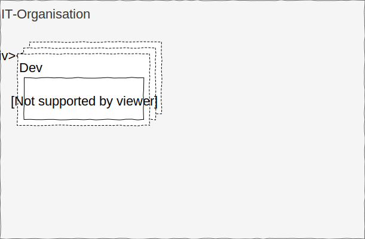
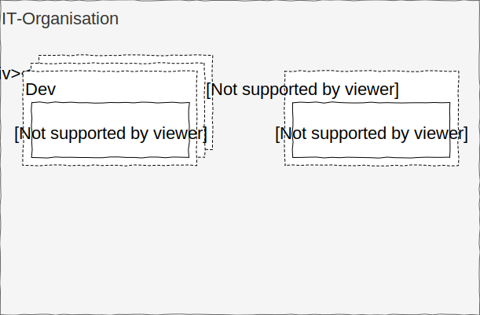
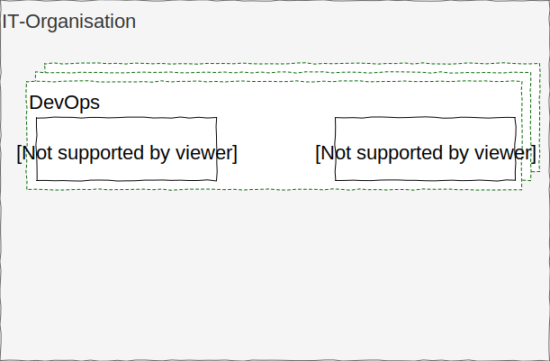
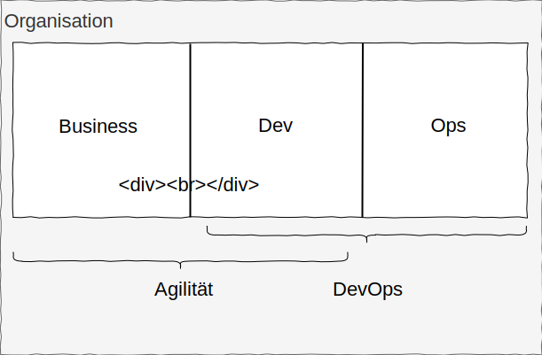
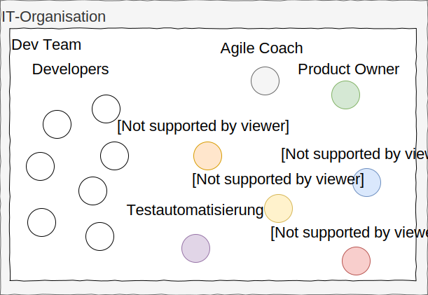
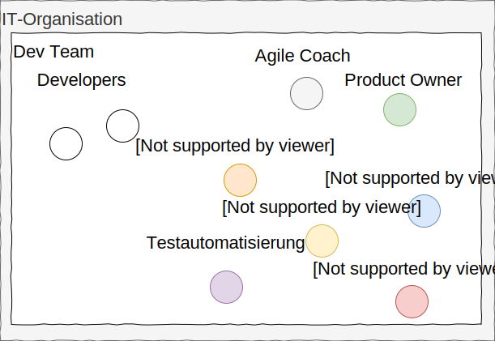
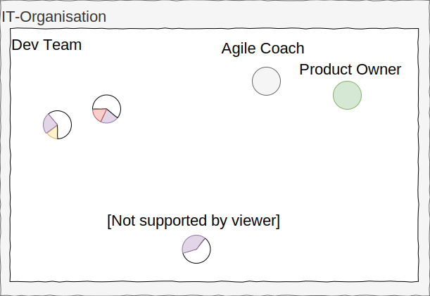
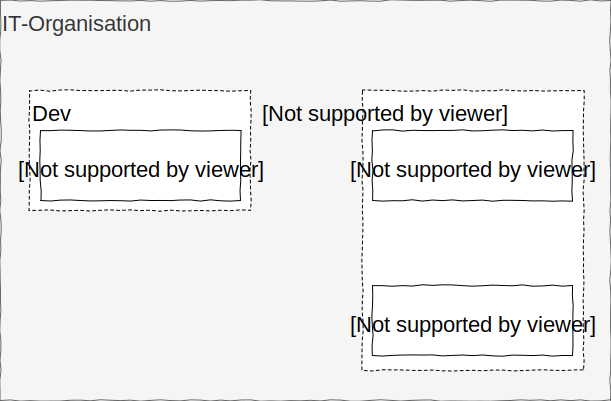
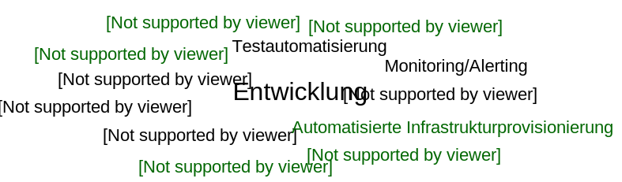

# DevOps
## Mehr als nur ein Hype?

Uwe.Bessle@iteratec.de

Notes:
* Herzlich Willkommen zum DevOps Vortrag im Rahmen des ITMC Innovation Forums 2019.
* Meine feste Überzeugung ist es, dass das Thema DevOps mehr als nur ein Hype ist. DevOps wird das Anforderungsprofil, an die künftige Arbeit als Software-Entwickler aber auch an die generelle Organisation der IT in Unternehmen nachhaltig verändern.
* Aber lasst uns mit der Frage starten, ob DevOps überhaupt ein Hype ist.

---

## DevOps - ein Hype

Das Interesse an DevOps wächst kontinuierlich

Notes: Uwe
Wie man an den Daten von Google Trends sieht, steigt das Interesse am Thema DevOps seit 2014 kontinuierlich an. Seit ca. Mitte 2018 hat sich diese Entwicklung sogar noch beschleunigt.

----

## DevOps - ein Hype

Zum Vergleich das Interesse an Kubernetes

Notes: Uwe
Damit Ihr ein Gefühl für das absolute Interesse an dem Thema bekommt, habe ich hier mal den Vergleich zum Interesse an Kubernetes dargestellt.
Wie man sieht, hat Kubernetes den anfänglichen Rückstand seit Anfang 2016 kontinuierlich aufgeholt und ist in der ersten Hälfte 2017 an DevOps vorbei gezogen. Wer genau hinschaut erkennt aber, dass DevOps seit Mitte 2018 beim Wachstum gleich gezogen hat und langsam wieder Boden gut macht.

----

## DevOps - ein Hype

China und Indien liegen weit vorn beim Interesse an DevOps

Notes: Uwe
Besonders interessant war für mich die Auswertung nach Regionen. China und Indien liegen weit vorn.

----

## DevOps - ein Hype

Die USA und Großbritannien müssen aufpassen, nicht abgehängt zu werden

Notes: Uwe
Während die üblichen Vorreiter, also die USA und Großbritannien mit deutlichem Abstand bei den Google Suchanfragen folgen.

----

## DevOps - ein Hype

Deutschland rangiert momentan unter ferner liefen

Notes: Uwe
Deutschland rangiert da schon etwas abgeschlagen nach Südafrika und knapp vor Litauen.

----

## DevOps - ein Hype

DevOps Stellenausschreibungen auf StepStone

Notes: Uwe
Auch auf dem Stellenmarkt spielt das Thema DevOps inzwischen eine große Rolle. Hier einmal exemplarisch 1310 Stellenausschreibungen Anfang Mai auf StepStone für DevOps

----

## DevOps - ein Hype

DevOps Stellenausschreibungen auf Indeed

Notes: Uwe
Bei Indeed sind es aktuell sogar mehr als 2.200 Stellenausschreibungen, davon immerhin 170 in Hamburg

---

## Was bedeutet DevOps?

Notes: Uwe
- DevOps ist also tatsächlich aktuell ein Hype-Thema.
- Aber was verbirgt sich hinter diesem komischen Kunstwort ?
- Wenn ich so lese, was in den vorhin angesprochenen Stellenausschreibungen und diversen Artikeln drin steht, dann beschleicht mich das Gefühl, dass viele keine Ahnung haben, wovon sie da eigentlich sprechen bzw. schreiben.
- Dabei ist es eigentlich ganz einfach.

----
## Was bedeutet DevOps?

Notes:
Bei DevOps geht es genau darum, Applikations-Entwicklung

----
## Was bedeutet DevOps?

Notes:
und Betrieb von Anwendungen,
----
## Was bedeutet DevOps?

Notes:
- also das, was früher streng durch eine hohe Mauer getrennt war,
- über die dann ab und zu mal ein fertiges Release geworfen wurde,

----
## Was bedeutet DevOps?

Notes:
zusammenzubringen.

---

## Was tut man da?

Notes:
- Irgendwie klingt das jetzt noch nicht so richtig revolutionär.
- Was ändert sich denn jetzt eigentlich durch DevOps?
- Was tut man denn da so?

----
## Was tut man da?

Notes: Uwe
- Eigentlich ist das ziemlich trivial. Entwickler tun das, was sie immer tun,
- sie entwickeln Programme, die Dinge, die bisher manuell getan wurden, automatisiert tun, nur dass sie das eben auf die üblichen Administrations-(OPS-)Aufgaben anwenden
- Wenn ein Admin bislang einen Server manuell installiert hat, dann tut das bei DevOps jetzt ein Stückchen Programm.
- Das heißt dann zu neudeutsch automatisierte Infrastrukturprovisionierung.

----
## Was tut man da?

Notes: Uwe
- Damit das gut klappt, verfolgt man als DevOps Engineer einen Ansatz, der sich "Infrastructure as Code" nennt.
- bei diesem Ansatz beschreit man deklarativ oder prozedural als Code, welche Infrastruktur benötigt wird.
- Wenn man diesen Code dann ausführt, wird automatisch die passende Infrastruktur erzeugt
- oder eben abgerissen, wenn sie nicht mehr benötigt wird

----
## Was tut man da?

Notes: Uwe
- Das ganze betrifft aber nicht nur die Erzeugung, Provisionierung und Löschung von Infrastrukturprovisionierung
- sondern z.B. auch die Sicherung, Wiederherstellung und Überwachung (Monitoring und Alerting) der betriebenen Systeme

----
## Was tut man da?

Notes: Uwe
- Das Prinzip "Infrastructure as Code" geht aber weit über das Thema Automatisierung hinaus.
- Was macht heute jeder anständige Entwickler?
- Er versioniert seinen Code, vorzugsweise in github
  * damit keine Änderungen verloren gehen
  * damit es zu jeder Änderung einen Commit-Kommentar gibt, der die Intention der Änderung festhält
  * also z.B. die Nummer des zugehörigen Tickets oder der zugrunde liegenden Feature_Story

----
## Was tut man da?

Notes: Uwe
- und natürlich schreibt man als Entwickler für seinen Code vernünftige automatisierte Tests

----
## Was tut man da?

Notes: Uwe
- wann immer es Änderungen gibt, sorgen entsprechende Pipelines für die Continuous Integration

----
## Was tut man da?

Notes: Uwe
- die dann Änderungen über diverse Stages
- mit den entsprechenden Tests

----
## Was tut man da?

Notes: Uwe
- letztendlich möglichst automatisch live stellen
- im Sinne eines Continuous Delivery

----
## Was tut man da?

Notes: Uwe
* Letztendlich geht es also schlicht darum, die bewährten Methoden aus der Entwicklung (Dev) auch auf den Betrieb (Ops) anzuwenden:
    * Automatisierung
    * Versionierung
    * Tests
    * Staging
    * Continuous Integration / Continuous Delivery

---
## Warum DevOps?

Notes: Uwe
- OK, was man als DevOps Engineer so macht, ist hoffentlich einigermaßen klar
- Bleibt nur die Frage, ob sich das auch lohnt.
- Warum macht es Sinn, DevOps in den Unternehmen einzuführen?
- Was bringt das eigentlich?

----
<!-- .slide: class="warum-devops" -->
## Warum DevOps?

### Skalierbarkeit in der Infrastruktur
- 1 Server betreibt jeder manuell
- 10 Server geht noch
- 100 Server geht zur Not
- 1.000 Server sind manuell schon nicht mehr praktikabel betreibbar
- 100.000 Server manuell zu betreiben, ist unvorstellbar

Notes:
- Der ursprüngliche Treiber für DevOps waren die enorm gestiegenen Anforderungen an die Skalierung der Infrastruktur.

----
<!-- .slide: class="warum-devops" -->
## Warum DevOps?

### Skalierbarkeit in der Infrastruktur
### you build it, you run it
* höhere Verfügbarkeit
* bessere Betreibbarkeit

Notes:
- Nicht jeder Firma hat die Probleme von Facebook, Amazon und Google
- Die für mich entscheidende Triebfeder für den Run Richtung DevOps lautet deshalb, "you build it, you run it".
- Heerscharren von Admins haben sich in der Vergangenheit über schlecht betreibbare Software von den Entwicklern beschwert.
- Und um ehrlich zu sein, viel zu oft hatten sie mit ihren Beschwerden recht.
  * unklare Fehlermeldungen
  * Tonnen von Log-Einträgen, die die Platte zumüllen ohne einen Funken Nutzen für den Admin
  * fehlende, unvollständige und veraltete Betriebshandbücher
  * undokumentierte Konfigurationseinstellungen
  * fehlende Robustheit im Fehlerfall
- All das verursacht Schmerzen bei den Admins, die die Fehler und Unzulänglichkeiten der Entwickler mit viel Einsatz und nächtlichen Bereitschaftsdiensten ausbaden müssen
- Mit DevOps landen diese Schmerzen jetzt erstmalig bei denen, die auch die Mittel und Möglichkeiten haben, die Ursachen dieser Schmerzen mit Stumpf und Stiel auszurotten, nämlich den Entwicklern.
- Das Ziel ist nicht, dass zukünftig die Entwickler Freitag Nacht aus dem Bett geklingelt werden, weil das neueste Deployment vom Freitag Nachmittag fehlerhaft war.
- Das Ziel ist, dass Software-Lösungen gebaut werden, bei denen nach einem Release-Termin gar niemand mehr rausgeklingelt werden muss.

----
<!-- .slide: class="warum-devops" -->
## Warum DevOps?

### Skalierbarkeit in der Infrastruktur
### you build it, you run it
### Development Speed
* bessere Time to Market
* mehr Flexibilität bei der Weiterentwicklung

Notes:
- Der dritte ganz wichtige Punkt ist mehr Speed bei der Entwicklung und Live-Stellung neuer Features
- Jeder Entwickler weiß, wie nervig und zeitaufwändig es in der Vergangenheit war, die Admins von selbst kleinsten Änderungen der Infrastruktur zu überzeugen
- da mussten Tickets geschrieben und vor allen Dingen mühsam gerechtfertigt werden
- für nahezu jede Änderung musste man wegen potentiell möglicher Auswirkungen einen extra Antrag beim Change Advisory Board stellen
- und selbst simpelste Änderungen dauerten schon mal eine Woche oder auch noch viel länger
- Mit DevOps gehören diese Verzögerungen der Vergangenheit an, weil im gleichen Team jemand mitarbeitet, der das einfach alles mehr oder weniger sofort tun kann, ohne noch groß bei anderen Abteilungen betteln zu müssen

---

## Mehr Speed?
## War das nicht der Grund für Agilität?

Notes:
- Stop, mehr Speed?
- Das war doch das Thema mit der Agilität.
- Was hat das denn jetzt wieder mit DevOps zu tun?

----
### Verhältnis Agilität <=> DevOps

&nbsp;

Notes: Uwe
- Lasst uns dazu einmal auf folgendes Bild schauen

----
### Verhältnis Agilität <=> DevOps

&nbsp;

Notes: Uwe
- Bei DevOps geht es darum, die Schranken zwischen der Entwicklung und dem Betrieb von Anwendungen einzureißen.
- Das hilft bei der Qualität der erbrachten Leistungen und insbesondere bei der Stabilität der Systeme
- Das hilft aber auch dabei, die Geschwindigkeit von Änderungen zu erhöhen, indem die Verzögerung eliminiert wird, die unweigerlich an Teamgrenzen eintritt, um notwendige Abstimmungen und Umpriorisierungen herbeizuführen.

----
### Verhältnis Agilität <=> DevOps

&nbsp;

Notes: Uwe
- Bei Agilität widerum geht es darum, den Entwicklungsprozess flexibler und schlanker zu machen, damit der Fokus der Arbeit auf dem Erreichen von Businessnutzen für den Kunden bzw. Anwender und nicht auf irgendwelchen Formalien liegt.
- Während es bei DevOps darum geht, die Schranken zwischen Entwicklern und Betrieb einzureißen, geht es bei Agilen Projekten und Vorgehensweisen unter anderem darum, die Schranken zwischen der Fachabteilung und den Entwicklern einzureißen

----
### Verhältnis Agilität <=> DevOps

&nbsp;

Notes: uwe
- Wenn wir beide Trends zusammennehmen, dann landen wir bei Agilen Teams mit DevOps-Kompetenz
- in der heutigen Zeit gibt es natürlich auch dafür eine Abkürzung

----
### Verhältnis Agilität <=> DevOps

Biz
-------

----
### Verhältnis Agilität <=> DevOps

BizDev
--------

----
### Verhältnis Agilität <=> DevOps

BizDevOps
---------

---

## Wie organisiert man DevOps in der Praxis?

Notes: uwe
- Na gut, das mit der Agilität hätten wir geklärt.
- Aber wie organisiert man denn DevOps heute tatsächlich in der Praxis?
- Wie sieht das in den realen Projekten aus?

----

&nbsp;
----------

Notes:
Schauen wir uns doch mal an, wie das in der Praxis meistens läuft
- In einem Entwicklungs-Team gibt es natürlich eine Reihe von Entwicklern

----

&nbsp;
----------

Notes:
- In agilen Projekte kommt dann in der Regel noch ein Agiler Coach oder auch Scrum Master hinzu
- und auf alle Fälle natürlich auch ein sogenannter Product Owner

----

&nbsp;
----------

Notes:
- sobald DevOps ins Spiel kommt, wird in der Regel versucht, diese Aufgabe durch einen spezialisierten DevOps Engineer zu besetzen.
- Meist kommt der aus dem bisherigen Admin-Team

----

&nbsp;
----------

Notes:
* Neben dem DevOps Engineer gibt es meistens aber noch mehr spezialisierte Rollen im Team
  * den Security-Champion
  * den UX-Experten
  * den Testautomatisierer
  * den Performance-Experten
  * und und und

----

Team <= 10
----------

Notes:
* Problematisch wird es, wenn man die optimale Teamgröße agiler Teams einhalten will
* also das 2-Pizza-Team mit nicht mehr als 6-10 Teammitgliedern

----

Team <= 10
----------

Notes: Steven
* wenn man die Nachteile großer Teams vermeiden will, dann führen viele Spezialisten im Team unweigerlich dazu, dass nur noch wenige "normale" Entwickler im Team verbleiben können
* das macht Teams aber auch nicht gerade produktiv

---

## Wie funktioniert DevOps richtig?

Notes:
* Wie lösen erfolgreiche Unternehmen dieses Problem auf?

----

&nbsp;
----------

Notes:
* Schauen wir uns einfach noch mal das Bild an, dass ich gerade gezeigt habe.
* Ein Team mit wenig Fußvolk, also Entwicklern und dafür vielen spezialisierten Rollen

----

&nbsp;
----------

Notes: Uwe
+ In einem Bereich liegt die Lösung auf der Hand
* Entwickler entwickeln heute schon nicht ausschließlich
* die Testautomatisierung und insbesondere die Unittests gehören heute als integraler Bestandteil zur Entwicklung dazu
* Dazu mussten die Entwickler eine ganze Menge über Tests lernen
* und natürlich gibt es heutzutage eine Vielzahl leistungsstarker Werkzeuge, die es dem Entwickler erleichtern, die Testautomatisierung neben seiner sonstigen Entwicklungstätigkeit mit zu erledigen
* nichts desto trotz, gibt es in vielen Teams Teammitglieder, die eine besondere Affinität und einen stärkeren Fokus auf das Thema Tests haben, also quasi die Testexperten im Team sind

----

&nbsp;
----------

Notes: Uwe
* Das gleiche passiert schrittweise auch mit anderen querschnittlichen Kompetenzen, die langsam aber sicher ebenfalls zur Entwicklung gehören
* Damit geht der Trend in manchen Bereichen wieder vom Spezialisten zum vielseitigen Generalisten
* Trotzdem werden Entwickler auch einen Fokus haben, wo sie im Team über das meiste Wissen verfügen und auf einem Gebiet quasi als Champion agieren
* Letztendlich glauben wir, dass die DevOps-Rolle in einem agilen Team nicht durch ein spezialisiertes Rolle Teammitglied besetzt wird. Vielmehr handelt es sich bei DevOps um eine Fähigkeit, über die mehrere Mitglieder im Team und damit das gesamte Team verfügen ==> Mein Zielbild ist also das DevOps-fähige Team

----

Biz
----------------

Notes: Uwe
- wenn man eine Vorliebe für Kunstbegriffe hat, dann landet man quasi beim

----

BizUX
----------------

----

BizUXSec
----------------

----

BizUXSecDev
----------------

----

BizUXSecDevQA
----------------

----

BizUXSecDevQAOps
----------------

---

## Was spricht gegen DevOps?

Notes: Uwe
* Auch wenn das jetzt alles einfach und logisch klang, können wir dennoch in vielen Unternehmen erkennen, dass sie sich schwer tun mit der Einführung von DevOps.
* Wo liegen nach meiner Erfahrung die Knackpunkte, bei denen viele Unternehmen ins Schwitzen kommen, wenn es um die Einführung von DevOps geht?

----
## Was spricht gegen DevOps?
### 24*7 Support?

Notes:
* Das größte Problem lauert für viele beim 24*7 Support.
* "Den will doch kein Entwickler machen" ist das Standard-Argument der DevOps-Skeptiker
* Und in der Tat, beim Thema Wochenendbereitschaft, dreht sich vielen Entwicklern der Magen um

----

### Zusammenspiel zwischen Entwicklung und Betrieb

Notes: Steven
* Der Denkfehler vieler DevOps Skeptiker sowohl aus den Reihen der Admins als auch der Entwickler liegt darin, dass sie von der heutigen Ausgangssituation ausgehen, also von schlecht betreibbaren Anwendungen
* Dabei passiert in Wirklichkeit eines, die Entwickler haben eine hohe intrinsische Motivation, Schmerzen zu vermeiden, also nächtliche Anrufe am Wochenden. Und sie haben die Möglichkeit, Maßnahmen zu ergreifen, die nächlichen Anrufen vorbeugen
* Früher oder später wird allen Beteiligten klar, dass sich alles, was sich in einem Run-Book aufschreiben lässt, um einen Betrieb durch Dritte zu ermöglichen,
* dass sich das alles auch automatisieren lässt, so das gar kein Mensch im Störungsfall mehr eingreifen muss
* Wir haben erst vor kurzem in einem größeren Architektur-Review bei einem Kunden in der Praxis überprüfen können, welchen großen Schritt die Systemlandschaft in Sachen Robustheit und Betreibbarkeit gemacht hat, seitdem die Betriebsverantwortung aus einer zentralen Betriebsabteilung in die Teams verlagert wurde.
* Dort funktioniert der automatisierte 24x7 Betrieb der Anwendungen inzwischen so gut, dass man auf eine formale, vertraglich fixierte Bereitschaft seitens der Teams trotz 24x7 Betrieb und hohen Anforderungen an die tatsächliche Verfügbarkeit verzichten kann.
* Die Teammitglieder veröffentlichen ihre Telefonnummern für den Störfall freiwillig, weil sie wissen, dass dieses Ereignis nur extrem selten eintreten wird.

----

## Was spricht gegen DevOps?
### 24*7 Support?
### Effizienz?

* Behauptung: der erfahrene Admin ist viel effizienter bei der Betreuung und Wartung vieler Server
* DevOps-Realität: KnowHow steckt im Code (IaC), der von vielen genutzt werden kann

----

## Was spricht gegen DevOps?
### 24*7 Support?
### Effizienz?
### Wer betreibt die zentrale Infrastruktur?

Notes:
* das zweite Totschlag-Argument der DevOps-Skeptiker ist in der Regel die zentrale Infrastruktur,
* Wo bleibt bei der Einfühgun von DevOps der Betrieb der zentralen Infrastruktur?

----

Notes:
* Ich hatte bei der Darstellung der traditionellen Aufgabenverteilung zwischen Entwicklung und Betrieb ein wenig geschummelt.

----

Notes:
* In Wirklichkeit verantwortet Ops neben dem Applikationsbetrieb bisher auch den Betrieb der Basis-Infrastruktur

----

Notes:
* und in Wirklichkeit, benötigt man für die zentrale Infrastruktur natürlich nicht nur einen Betrieb, sondern auch eine Weiterentwicklung

----

Notes:
* Wir haben beim Thema DevOps bislang immer nur über die Zusammenlegung von Anwendungs-Entwicklung und -Betrieb gesprochen, also Application DevOps

----

Notes:
* Das DevOps Prinzip trifft aber genauso auch auf die Bereitstellung der zentralen Infrastruktur zu.
* Das erfordert querschnittliche Kompetenzen
* Wiederkehrende DevOps-Aufgaben werden in Form von Libraries abstrahiert und den verschiedenen Teams zur Verfügung gestellt (z.B. Terraform Module)
* Die Application Teams konsumieren die zentrale Infrastruktur (oder die Cloud-Infrastruktur) durch Self Services

----

Notes:
* Letztendlich wird die Zweiteilung in Entwicklung und Betrieb also durch eine Zweiteilung in Applikationen und Infrastruktur ersetzt
* Auf beiden Ebenen werden DevOps Prinzipien und Technologien zum Einsatz gebracht
* Aus den alten OPS-Teams werden einzelne Mitarbeiter in die Applikations-Teams wechseln, um die Ops-Kompetenzen in den Applikations-Teams zu stärken
* Gleichzeitig werden auch einzelne Entwickler in die Infrastruktur-Teams wechseln, um die Entwicklungs-Kompetenzen in diesen Teams zu stärken.

---

## Wie erwerbe ich als Entwickler das benötigte DevOps-KnowHow?

Notes:
* Wie einzelne OPS-Mitarbiter in die Anwendungs-Teams wechseln oder auch geschickt werden, kann ich mir ja noch gut vorstellen.
* Aber wie soll das funktionieren, dass zukünftig alle oder zumindest viele Entwickler sich mit den OPS- und Infrastruktur-Themen auskennen?

----

Notes: Uwe
* In der Tat, das ist eine sehr berechtigte Frage.
* Lässt uns noch einmal auf das Bild vom Anfang schauen, wo ich erklärt habe, was die DevOps Tätigkeiten ausmacht.
* Mit den meisten dort genannten Dingen, wie z.B. Testautomatisierung, kennt sich Otto Normal-Entwickler wunderbar aus.

----

Notes: Uwe
* Es gibt aber auch Themen, wie automatisierte Infrastrukturprovisionierung und Infrastructure as Code, die für viele Entwickler noch Neuland darstellen.
* Dazu kommen weitere Kompetenzen, um die sich bislang die Admins gekümmert haben

----

Notes: Uwe
* Betriebssysteme

----

Notes: uwe
* Server-Administration

----

Notes: Uwe
* Netzwerk und andere Infrastruktur

----

Notes: Uwe
* Cloud-Services bei Amazon, Google & Co.

----
<!-- .slide: class="col-2" -->

&nbsp;

Notes: uwe
* Learning by Doing ist hier für mich das große Stichwort
* Gerade in der Zusammenarbeit von ehemaligen OPS-Mitarbeitern und interessierten Entwicklern können beide Seiten viel voneinander lernen
* Zu Infrastructure as Code gehört für mich auch das gemeinsame Arbeiten an diesem Code in Form von Pair Programming, einer optimal für das Lernen geeigneten Form der Zusammenarbeit im Entwicklungs-Team
* Daneben gehört aber auch die explizite Ausbildung in Form von Trainings mit auf die Agenda.

----
<!-- .slide: class="col-2" -->

Kamran Ahmed
https://github.com/kamranahmedse/developer-roadmap#devops-roadmap

Notes: Uwe
* Auf github findet sich dazu mit der DevOps RoadMap ein übersichtlicher Fahrplan, den man einfach und schnell auf die eigenen Bedürfnisse im Unternehmen anpassen und abwandeln kann.

----
<!-- .slide: class="col-2" -->

Kamran Ahmed
https://github.com/kamranahmedse/developer-roadmap#devops-roadmap
  
Javin Paul
https://hackernoon.com/the-2018-devops-roadmap-31588d8670cb

Notes: Uwe
* Auf Hackernoon hat der Verfasser Javin Paul noch einen erläuternden Blog-Beitrag veröffentlicht

---
## Aktuelle Herausforderungen?

----
## Aktuelle Herausforderungen?

### Wandel der Infrastruktur
* physikalischer Server
* Virtual Machine
* Docker Orchestration Platform
* Serverless

----
## Aktuelle Herausforderungen?

### Wandel der Infrastruktur
### Cloud-Provider Abhängigkeit
* AWS-Lambda / Azure Functions / Google Cloud Function
* Hoffnungsschimmer: K-Native

----
## Aktuelle Herausforderungen?

### Wandel der Infrastruktur
### Cloud-Provider Abhängigkeit
### Konsequenzen für den verwendeten Technologie-Stack
* Abrechnung von Serverless nach RAM-Verbrauch
* JVM + SpringBoot >100MB <=> Go 1 MB
* GraalVM

---

## Fazit: DevOps ist mehr als ein Hype

* an DevOps führt in Zukunft kein Weg vorbei <!-- .element: class="fragment" -->
* Start Doing <!-- .element: class="fragment" -->
* Learn Fast <!-- .element: class="fragment" -->
* Die Welt wartet nicht darauf, dass wir in Deutschland aus dem Knick kommen <!-- .element: class="fragment" -->

---

## Noch Fragen?

Uwe Bessle @bessi65 
[uwe.bessle@iteratec.com](mailto:uwe.bessle@iteratec.com)

https://iteratec.de

https://github.com/UBessle/ITMC-DevOps-slides
